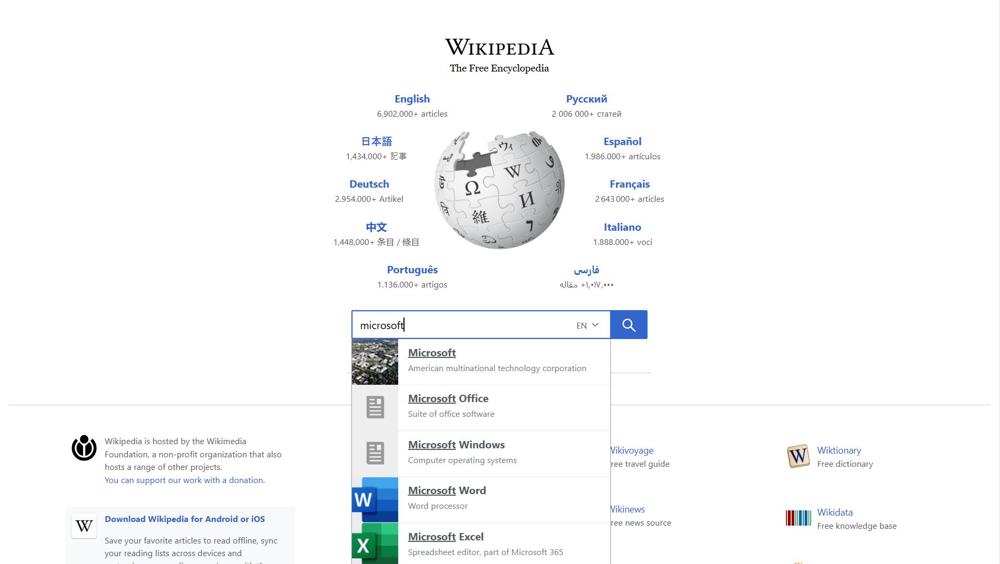

# 📚 **Automating Wikipedia Search and Navigation**  

<p align="center">
  
  
  
  
  
  
</p>

## 🌟 **Project Overview**  
This project automates the **search feature** of Wikipedia to validate key factual data, such as the names of organization founders, while ensuring smooth functionality of the platform’s header, footer, and hyperlink features.  

Key functionalities include:  
- Validating the search and hyperlink features.  
- Verifying the header, footer, and dropdown links for accuracy.  

---

## 🚀 **Scope of Work**  
The following test cases were automated using **Selenium**, **XPath**, and **Window Handling**:  
1. ✅ Verify the **Wikipedia Homepage URL**.  
2. 📜 Validate the **Wikipedia Header and Footer**.  
3. 🔍 Test the **Search Functionality**.  
4. 🌐 Verify **Hyperlink Functionality** for navigation.  
5. 🔗 Test the **'About Wikipedia' Link and URL** in the dropdown menu.  

---

## 🛠️ **Skills & Technologies Used**  
- **Selenium WebDriver** for robust automation.  
- **XPath** for locating elements precisely.  
- **Java** for writing test cases.  
- **Window Handling** for managing multiple browser tabs/windows.  

---

## 📸 **Snapshots of the Work**  
### **Wikipedia Homepage Automation**  
  

### **Search Functionality in Action**  
  

---

## 📚 **How to Run the Automation**  
1. Clone this repository:  
   ```bash
   git clone https://github.com/Gourab-Pal/QA-Wikipedia_automation.git
2. Install dependencies:  
    - **Selenium WebDriver**  
    - **ChromeDriver** (or your browser's driver)  

3. Run the test scripts using your favorite IDE or CLI.  

---

## 📜 **Learn More About XFlix**  

- [📘 XFlix Documentation](#) _([Project website](https://www.crio.do/learn/portfolio/gourab-pal-gpal/ME_XSEARCH2/))_  
- [🌐 Live Website](#) _([Wikipedia website](https://www.wikipedia.org/))_  

---


